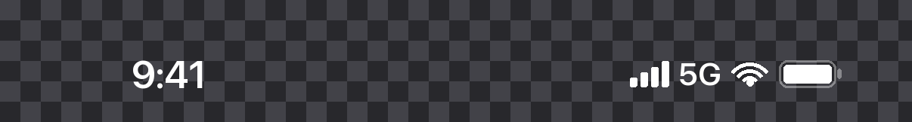

# invisibar

Hide the iOS status bar for screen recordings. Also removes the red recording
indicator.

One file you drop into your app, for SwiftUI, React Native, Expo or Flutter. It adds a
small debug-only footnote; tap it, record your screen, and the footage comes out with
no clock, no battery, no carrier — **and no red screen-recording indicator on the
Dynamic Island.**

Also packaged as a Claude Code skill, if you would rather it wired itself in.

| While screen recording | Toggle off | Toggle on |
|---|---|---|
| Time | 20:46 | gone |
| Signal / carrier / battery | shown | gone |
| Red dot on the Dynamic Island | shown, with red island outline | **gone** |

Verified on iPhone 17 Pro, iOS 26. Worth re-checking on new iOS majors rather than
trusting this table forever.

## Why

Marketing footage shot across several sessions has a different clock and a different
battery in every clip, and every frame is stamped with a recording indicator. Apple's
own material shows 9:41 and a full battery throughout. This gets you a clean top edge
to work from, and optionally a consistent status bar composited back on top.

## Platforms

| | File | Notes | Verified |
|---|---|---|---|
| SwiftUI | `swift/Invisibar.swift` | | Run on device and simulator |
| React Native | `react-native/Invisibar.tsx` | No native modules | Type-checks against RN 0.76 |
| Expo | `react-native/Invisibar.tsx` | Same file, unchanged | Type-checks against RN 0.76 |
| Flutter | `flutter/invisibar.dart` | No plugins | **Not yet run in an app** |

The Flutter port is written but has not been run. If you try it, an issue either way
is welcome.

iOS only by nature. Android has no Dynamic Island and draws its own recording
indicator, which none of this can touch.

## Usage

Copy the file for your platform into your app. Two call sites in each.

**SwiftUI**

```swift
WindowGroup { RootView().invisibar() }   // 1. at the root
InvisibarLink()                          // 2. wherever a footnote fits
```

**React Native / Expo**

```jsx
<Invisibar><App /></Invisibar>           // 1. at the root
<InvisibarLink />                        // 2. wherever a footnote fits
```

**Flutter**

```dart
runApp(const Invisibar(child: MyApp())); // 1. at the root
const InvisibarLink()                    // 2. wherever a footnote fits
```

That's it. The footnote is a dim bit of text reading "Invisibar". Tap it, pick **Hide
status bar** or **Replace status bar**, then scroll the link out of frame and record.
A small dot appears beside the footnote while it's on.

The root wrapper goes on the **outermost** thing your app shows. If your root returns
early for anything — a launch argument, a loading state, a separate onboarding root —
apply it above the branch, or those screens keep their status bar.

### Replace mode

Draws a clean 9:41 and a full battery instead of hiding everything, so what you record
is already finished and there's no editing step. Geometry is measured from real
captures and lands within 1–2px of the real bar on the reference device.

No Wi-Fi glyph outside SwiftUI: the arcs need SVG, and these files stay
dependency-free.

### Release safety

Nothing ships. `InvisibarLink` renders empty, the root wrapper returns your app
untouched, and no storage is touched — behind `#if DEBUG`, `__DEV__` and `kDebugMode`
respectively.

Measured on a real Release build, against a control string:

| String | Debug | Release |
|---|---|---|
| `invisibarMode` | 1 | **0** |
| `"Hide status bar"` | 1 | **0** |
| `"Built by Gokhun"` | 1 | **0** |
| `"9:41"` | 2 | **0** |
| `didRepairPermissions` (control) | 1 | 2 |

In SwiftUI the type names survive as metadata, because the API has to exist for your
call sites to compile. They carry no behaviour. The control being non-zero is what
makes the zeros mean anything.

### Not persisted, on purpose

React Native and Flutter keep the mode in memory, so it resets on reload. That avoids
a storage dependency, and it means you can't get stuck with a hidden status bar and no
obvious way back. SwiftUI persists it, because `@AppStorage` is free there.

## The two bugs it exists to prevent

Both were made on a real implementation, and both looked correct in review.

**Gating the value instead of the type.** Leave the UserDefaults key outside the
`#if DEBUG` with an unconditional `@AppStorage` reading it, and the Release binary
contains the key — the shipping build genuinely reads it and would hide the status
bar if anything set it. `strings` on the Release binary finds it twice.

**Applying the modifier below an early return.** If `body` returns early for any
branch — a launch argument, a loading state, a separate onboarding root — a modifier
applied further in silently misses those screens. In the original case that was the
one staged screen most likely to be recorded, and the before/after screenshots were
byte-identical across the top 1840 rows.

## Verification that doesn't fool you

`references/verify.md` is most of the value here. Every check has a way of passing for
the wrong reason:

- **`strings` needs a control.** A clean zero is also what a typo gives you. Check a
  key you know ships, in the same command.
- **The Debug binary is a stub.** Xcode puts the code in `App.debug.dylib` beside a
  ~58 KB launcher, so `strings App.app/App` returns nothing for everything and every
  check "passes".
- **A flat cross-correlation curve means your two screenshots are identical**, not
  that layout is stable. Confirm the status bar region actually differs first.
- **The simulator can't test the recording indicator at all.** `simctl io recordVideo`
  never draws one, so a simulator capture proves nothing either way.

## Optional: the PNG overlay

Replace mode covers most cases. The PNG is for editing after the fact — changing the
time or battery without re-recording, or footage already captured in hide mode.

```bash
python3 tools/make_status_bar.py --width 1206 --height 2622 --time 9:41 --out bar.png
```



Writes a transparent PNG — only glyph pixels have alpha, ~3% of the strip — to drop on
a track above your footage, top-left, no scaling. Geometry is measured, not guessed:
the generated cluster lands within 1px of the real thing on the reference device.

It can't restore the frosted backdrop, because hiding the bar takes the glass with it
and no flat PNG can blur what's beneath it. If you want that look, blur a duplicate
layer in your editor and mask it to the top strip. `references/overlay.md` covers it,
along with the ffmpeg route and the App Preview resolution requirement that rejects
native-resolution uploads.

## Cheaper option, no code

If you have a Mac and a cable, QuickTime already does this: File → New Movie
Recording, pick the iPhone as **both** camera and microphone. It substitutes 9:41 with
a full battery and no carrier, and there's no recording indicator because the capture
happens on the Mac. The status bar is real, so its backdrop is real and reacts to
content for free.


## Requirements

SwiftUI, any iOS version with `.statusBarHidden(_:)`. The generator needs Python 3 and
Pillow, and uses SF Pro from macOS by default (`--font` to point elsewhere).

## License

MIT
